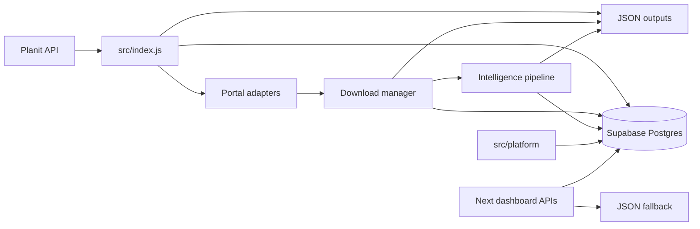
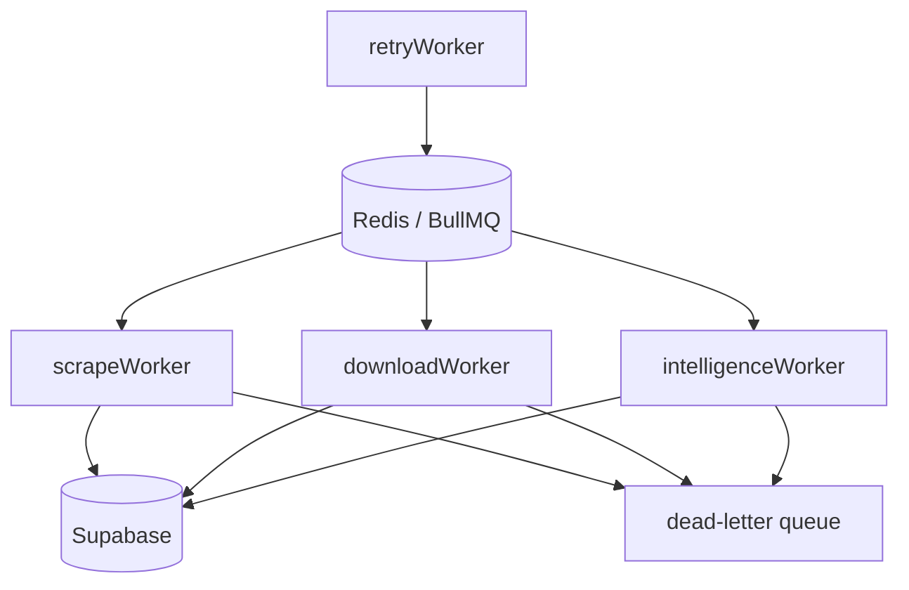

# Phase 9 Architecture

## Persistence Flow

## Worker Topology

## Compatibility Contract

- JSON outputs remain enabled.
- Supabase writes are best-effort unless `SUPABASE_URL` and `SUPABASE_SERVICE_ROLE_KEY` are present.
- Redis workers are optional and can run independently from the local MVP pipeline.
- Browser challenge handling classifies blocks and preserves diagnostics; it does not attempt to bypass protected systems.
